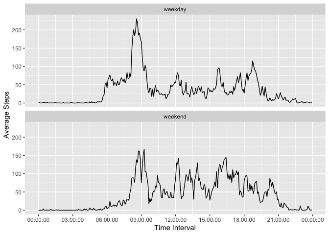

Load dependencies:

```r
# Load core tidyverse packages to access ggplot/stringr/dplyr/tibble.
library(tidyverse)
# Load {chron} package to make working with times easier.
library(chron)
```

## Loading and preprocessing the data
Load data (1):

```r
activity <- read.csv("data/activity.csv") %>% tibble

activity
```

```
## # A tibble: 17,568 × 3
##    steps date       interval
##    <int> <chr>         <int>
##  1    NA 2012-10-01        0
##  2    NA 2012-10-01        5
##  3    NA 2012-10-01       10
##  4    NA 2012-10-01       15
##  5    NA 2012-10-01       20
##  6    NA 2012-10-01       25
##  7    NA 2012-10-01       30
##  8    NA 2012-10-01       35
##  9    NA 2012-10-01       40
## 10    NA 2012-10-01       45
## # … with 17,558 more rows
```
Reformatting interval variable as standard time to ease interpretation (2):

```r
Sys.setenv(TZ='GMT')    # Avoids transformations since {chron} defaults to GMT 
                        # and ggplot forces system time

interval_chr <- sprintf("%04d", activity$interval) # Convert time intervals to strings
activity$time_interval <- times(paste0(
                                    substr(interval_chr, 1, 2), ":",
                                    substr(interval_chr, 3, 4), ":",
                                    "00")
                                ) # Convert strings to times

head(activity$time_interval) # Confirm that time intervals are now in correct format
```

```
## [1] 00:00:00 00:05:00 00:10:00 00:15:00 00:20:00 00:25:00
```

## What is mean total number of steps taken per day?
Calculate total steps per day:

```r
daily_total <- activity %>%
    filter(complete.cases(.)) %>% # Remove NAs for now
    group_by(date) %>%
    summarize(steps = sum(steps))

daily_total
```

```
## # A tibble: 53 × 2
##    date       steps
##    <chr>      <int>
##  1 2012-10-02   126
##  2 2012-10-03 11352
##  3 2012-10-04 12116
##  4 2012-10-05 13294
##  5 2012-10-06 15420
##  6 2012-10-07 11015
##  7 2012-10-09 12811
##  8 2012-10-10  9900
##  9 2012-10-11 10304
## 10 2012-10-12 17382
## # … with 43 more rows
```

A simple histogram of total daily steps (1b):

```r
ggplot(daily_total, aes(steps)) + 
    geom_histogram(binwidth = 750)
```

<!-- -->

Mean and median total daily steps (2):

```r
# Mean total daily steps
message(paste0("Mean total daily steps = ", mean(daily_total$steps)))
```

```
## Mean total daily steps = 10766.1886792453
```

```r
# Median total daily steps
message(paste0("Median total daily steps = ", median(daily_total$steps)))
```

```
## Median total daily steps = 10765
```

## What is the average daily activity pattern?
Grouping data by 5 minute interval:

```r
by_interval <- activity %>%
    filter(complete.cases(.)) %>%
    group_by(time_interval) %>%
    summarize(avg_steps = mean(steps))

by_interval
```

```
## # A tibble: 288 × 2
##    time_interval avg_steps
##    <times>           <dbl>
##  1 00:00:00         1.72  
##  2 00:05:00         0.340 
##  3 00:10:00         0.132 
##  4 00:15:00         0.151 
##  5 00:20:00         0.0755
##  6 00:25:00         2.09  
##  7 00:30:00         0.528 
##  8 00:35:00         0.868 
##  9 00:40:00         0     
## 10 00:45:00         1.47  
## # … with 278 more rows
```

Time series plot, average daily steps ~ time interval (1):

```r
by_interval %>%
    ggplot() +
    geom_line(aes(x = time_interval, y = avg_steps)) +
    scale_x_chron(format = "%H:%M:%S", n = 9) + # time scale on x-axis
    labs(x = "Time Interval",
         y = "Average Steps")
```

<!-- -->

Which five minute interval has the highest average activity across all days? (2):

```r
by_interval %>% filter(avg_steps == max(by_interval))
```

```
## # A tibble: 1 × 2
##   time_interval avg_steps
##   <times>           <dbl>
## 1 08:35:00           206.
```
So, the interval with the highest average step activity starts at 8:35 AM.

## Imputing missing values
Calculating number of missing values (1):

```r
sum(is.na(activity$steps))
```

```
## [1] 2304
```

Let's replace missing values with the mean for each five minute interval across all days (2) and create a new dataset with the imputed values (3). A quick function will make this easier:

```r
# Function that imputes missing values with the mean of all other values
impute_mean <- function(x) {
    replace(x, is.na(x), mean(x, na.rm = TRUE))
}

# Applying above function by group to impute using the mean for each respective day
activity_imp <- activity %>%
    group_by(time_interval) %>%
    mutate(steps = impute_mean(steps))
```

Now, if we run the same code from above, we see that there are no missing values:

```r
sum(is.na(activity_imp$steps))
```

```
## [1] 0
```

Now to revisit our histogram from before, with the imputed data. First we group and summarize:

```r
daily_total_imp <- activity_imp %>%
    group_by(date) %>%
    summarize(steps = sum(steps))

daily_total_imp
```

```
## # A tibble: 61 × 2
##    date        steps
##    <chr>       <dbl>
##  1 2012-10-01 10766.
##  2 2012-10-02   126 
##  3 2012-10-03 11352 
##  4 2012-10-04 12116 
##  5 2012-10-05 13294 
##  6 2012-10-06 15420 
##  7 2012-10-07 11015 
##  8 2012-10-08 10766.
##  9 2012-10-09 12811 
## 10 2012-10-10  9900 
## # … with 51 more rows
```

...and the same histogram setup (4):

```r
ggplot(daily_total_imp, aes(steps)) + 
    geom_histogram(binwidth = 750)
```

<!-- -->

Mean and median total daily steps, original versus imputed data (4):

```r
# Mean total daily steps (NAs excluded)
message(paste0("Mean total daily steps (original) = ", mean(daily_total$steps)))
```

```
## Mean total daily steps (original) = 10766.1886792453
```

```r
# Mean total daily steps (imputed)
message(paste0("Mean total daily steps (imputed) = ", mean(daily_total_imp$steps)))
```

```
## Mean total daily steps (imputed) = 10766.1886792453
```

```r
# Median total daily steps (NAs excluded)
message(paste0("Median total daily steps (original) = ", median(daily_total$steps)))
```

```
## Median total daily steps (original) = 10765
```

```r
# Median total daily steps (imputed)
message(paste0("Median total daily steps (imputed) = ", median(daily_total_imp$steps)))
```

```
## Median total daily steps (imputed) = 10766.1886792453
```

So the mean daily total is unchanged, which is unsurprising since we imputed using the mean of each (equally frequent) interval. The median daily total increased very slightly.

## Are there differences in activity patterns between weekdays and weekends?
Adding new variable {day} with possible values "weekday" and "weekend" (1):

```r
# Create new variable with conditional mutate call
activity_days <- activity_imp %>%
    mutate(day = case_when(is.weekend(date) ~ "weekend",
                           TRUE ~ "weekday"))

# Confirm that weekend and weekday are occurring in correct proportions
table(activity_days$day)
```

```
## 
## weekday weekend 
##   12960    4608
```

Panel plot showing weekday versus weekend trends (2):

```r
activity_days %>%
    group_by(time_interval, day) %>%
    summarize(avg_steps = mean(steps),
              time_interval = time_interval,
              day = day) %>%
    ggplot() +
    geom_line(aes(x = time_interval, y = avg_steps)) +
    scale_x_chron(format = "%H:%M:%S", n = 9) + # time scale on x-axis
    labs(x = "Time Interval",
         y = "Average Steps") +
    facet_wrap(~ day, ncol = 1)
```

<!-- -->
